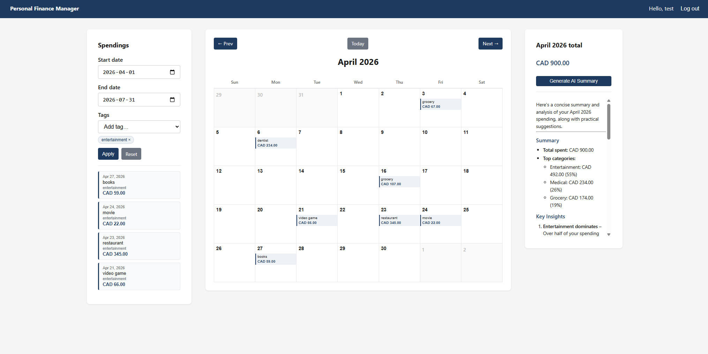
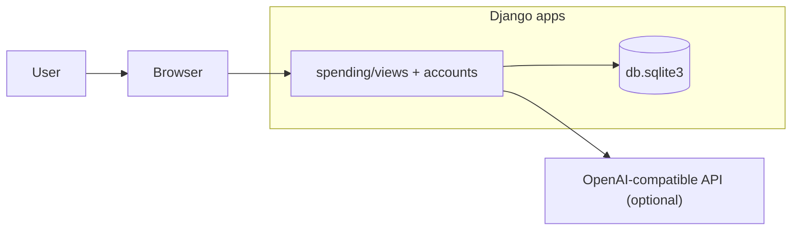

# Personal Finance Manager

A personal spending tracker built with Django. Log expenses on a calendar dashboard, filter by date range and tags, view monthly totals by currency, and optionally generate AI-powered spending summaries for each month.



## Features

- **User accounts** — Register, log in, and log out
- **Calendar view** — Browse spendings by month with a day-by-day calendar
- **CRUD spendings** — Add, edit, and delete entries via modal dialogs
- **Filtering** — Narrow the sidebar list by date range and tags
- **Monthly totals** — Totals grouped by currency (USD / CAD)
- **AI summaries** — Optional monthly analysis and suggestions via an OpenAI-compatible API

## Tech stack

- Python 3.12+ (required by Django 6)
- Django 6
- SQLite
- Vanilla HTML, CSS, and JavaScript templates

## Getting started

```bash
# Clone and enter the project
cd personal-finance-manager

# Create and activate a virtual environment
python -m venv .venv
.venv\Scripts\activate        # Windows
# source .venv/bin/activate   # macOS/Linux

# Install dependencies
pip install -r requirements.txt

# Environment (optional — needed for AI summaries)
copy .env.example .env        # Windows
# cp .env.example .env        # macOS/Linux
# Edit .env and set OPENAI_API_KEY if using AI summaries

# Set up the database
python manage.py migrate

# Run the development server
python manage.py runserver
```

Open [http://127.0.0.1:8000/](http://127.0.0.1:8000/), register a user, and start logging spendings.

## Configuration (optional AI)

Copy [`.env.example`](.env.example) to `.env` and set the variables below. AI summaries are optional; the rest of the app works without them.

| Variable         | Purpose                                                         |
| ---------------- | --------------------------------------------------------------- |
| `OPENAI_API_URL` | API base URL (default: OpenAI; works with compatible providers) |
| `OPENAI_API_KEY` | Required for AI summaries                                       |
| `OPENAI_MODEL`   | Model name (default: `gpt-4o-mini`)                             |

## Running tests

```bash
python manage.py test
```

Tests live in [`spending/tests.py`](spending/tests.py) and [`accounts/tests.py`](accounts/tests.py).

## Project layout

```
personal-finance-manager/
├── accounts/                  # User registration and auth
├── spending/                  # Spending model, views, AI summary
├── templates/                 # HTML templates
├── personal_finance_manager/  # Django settings and URLs
├── docs/                      # Screenshots for README
├── manage.py
└── requirements.txt
```

## Architecture



## Development notes

- `DEBUG = True` and a development `SECRET_KEY` are set in [`personal_finance_manager/settings.py`](personal_finance_manager/settings.py) — this configuration is not production-ready.
- Spendings are scoped per user; each account only sees its own data.
